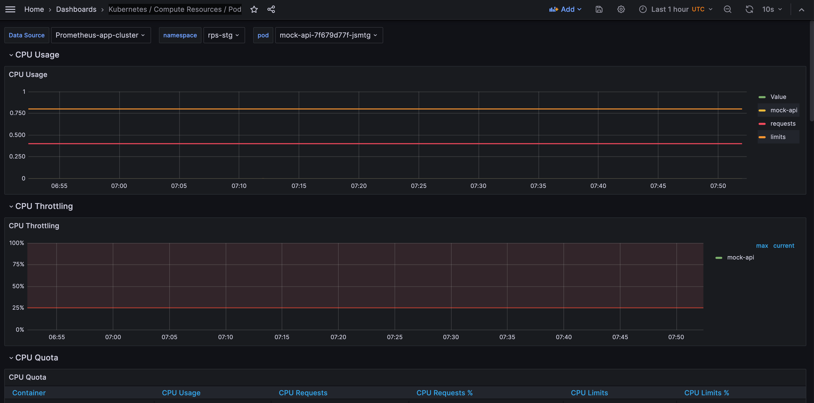

# Дашборды

## Авто-деплой конфигов для дашбордов

В папку dashboards кладутся JSON, экспортированные из Grafana.
CI/CD подхватывает эти JSON и накатывает дашборды на стенды.
https://confluence.zxz.su/pages/viewpage.action?pageId=306022349

## Загруженность подов
Метрика собирается экспортером Kubernetes в Prometheus. Далее визуализируется Grafana

1. Посмотреть можно в `Grafana > Dashboards > General > Kubernetes / Compute Resources / Pod`
2. Data Source: Prometheus-app-cluster
3. namespace: rps-{стенд}
4. pod: mock-api-{id}

Пример для stage:
